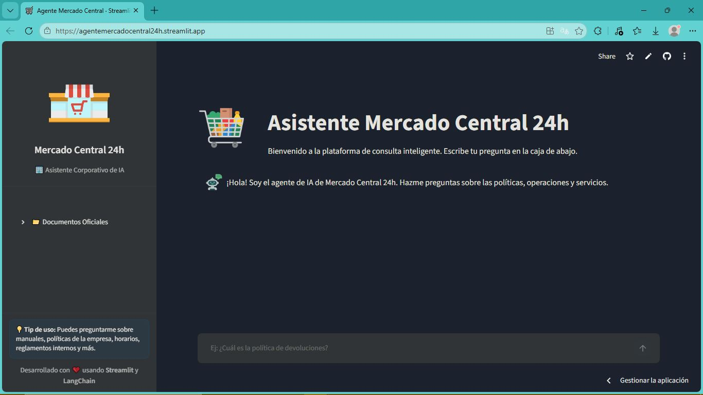
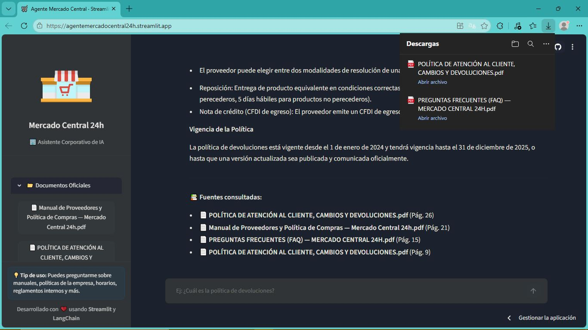

# 🛒 Asistente Mercado Central 24h - Agente de IA

## 📝 Descripción General
Este proyecto es un agente de Inteligencia Artificial diseñado para Mercado Central 24h. Su propósito es ayudar a las personas colaboradoras a encontrar información rápidamente dentro de los documentos internos de la empresa (manuales, políticas, etc.) mediante preguntas en lenguaje natural, evitando que pierdan horas buscando datos en archivos extensos.

## 🏗️ Arquitectura de la Solución
El sistema utiliza un enfoque RAG (Retrieval-Augmented Generation) que consta de las siguientes etapas:
1. **Carga y Fragmentación:** Los documentos PDF se leen desde el directorio `/static` utilizando `pymupdf`. Se procesan documentos PDF locales extrayendo su texto y dividiéndolo en fragmentos semánticos usando `RecursiveCharacterTextSplitter` de `langchain`.
2. **Embeddings e Índice Vectorial:** Se generan representaciones vectoriales del texto utilizando el modelo de Cohere y se almacenan en un índice en memoria (`InMemoryVectorStore`).
3. **Recuperación (Retrieval):** Ante una consulta del usuario, el sistema busca los fragmentos de texto más relevantes en la base vectorial.
4. **Generación:** Se envía el contexto recuperado junto con el historial de la conversación a un modelo de lenguaje (LLM) de Groq (`llama-3.3-70b-versatile`) para generar una respuesta precisa y fundamentada exclusivamente en los documentos.
5. **Interfaz de Usuario:** Una aplicación web interactiva desarrollada con Streamlit que mantiene el estado de la sesión y el historial de chat.

## 🛠️ Tecnologías y Herramientas Utilizadas
* **Lenguaje:** Python 3.13
* **Framework IA:** LangChain
* **Interfaz Gráfica:** Streamlit
* **Embeddings:** Cohere (`embed-v4.0`)
* **Modelo de Lenguaje (LLM):** Groq (`llama-3.3-70b-versatile`)
* **Procesamiento de PDF:** PyMuPDF
* **Despliegue:** Streamlit Community Cloud

## 🚀 Instrucciones para Ejecutar el Proyecto (Local)

1. **Clonar el repositorio:**
   ```bash
   git clone https://github.com/alexiv482/proyectoAIFinal.git
   cd "proyectoAIFinal"

2. **Crear y activar un entorno virtual:**
   ```bash
   python -m venv venv
   source venv/bin/activate
   # En Windows: venv\Scripts\activate

3. **Instalar las dependencias:**
   ```bash
   pip install -r requirements.txt

   
4. **Configurar las Variables de Entorno:**
   Crea un archivo .env en la raíz del proyecto y agrega tus claves de API para Groq y Cohere:
   ```bash
   GROQ_API_KEY="tu_api_key_de_groq"
   COHERE_API_KEY="tu_api_key_de_cohere"

5. **Preparar la Base de Conocimiento:**
   Asegúrate de que exista una carpeta llamada `static` en el directorio raíz y coloca allí los documentos PDF oficiales de la empresa.

6. **Ejecutar la aplicación:**
   ```bash
   streamlit run main.py

## 💬 Ejemplos de Interacción (Q&A)

El agente es capaz de mantener el contexto de la conversación y responder a preguntas específicas sobre la documentación.

* **Pregunta de Ejemplo 1: "¿Cuáles son las ubicaciones?"**

   * Respuesta del Agente: Según la documentación proporcionada, Mercado Central 24h tiene ubicaciones en Ciudad de México y Guadalajara.

* **Pregunta de Ejemplo 2: "¿Cuál es la política de devoluciones?"**

   * Respuesta del Agente: Detalla las normas basadas en la Ley Federal de Protección al Consumidor (LFPC), especificando los plazos (ej. 15 días para artículos de temporada o electrónicos). Además, cita directamente el documento PDF desde donde extrajo la respuesta.

## 🌐 Evidencia del Deploy (Implementación en la Nube)

El proyecto se encuentra desplegado de manera pública utilizando Streamlit Community Cloud, garantizando accesibilidad y un entorno de ejecución continuo.

🔗 Enlace de la aplicación en vivo: https://agentemercadocentral24h.streamlit.app/

**Interfaz Inicial:**


**Captura de pantalla del funcionamiento en producción:**
